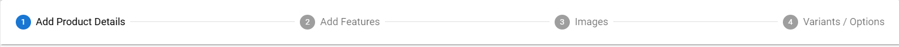
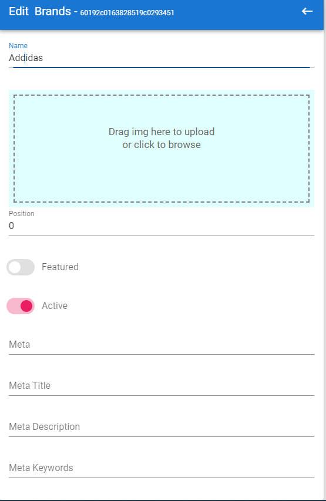
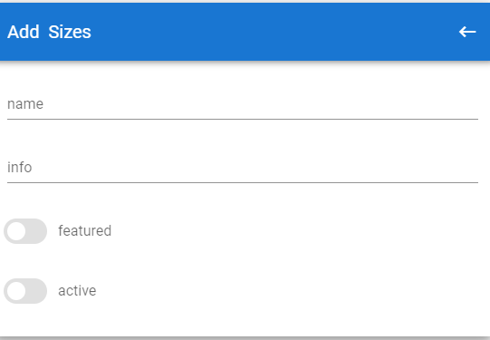
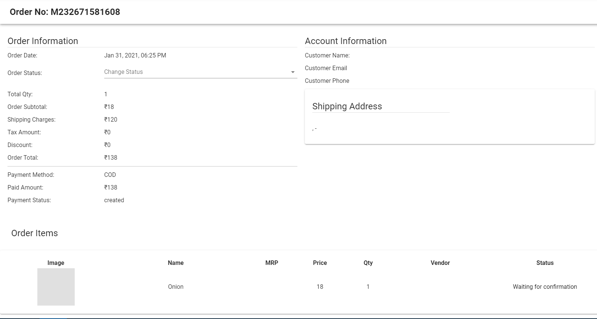
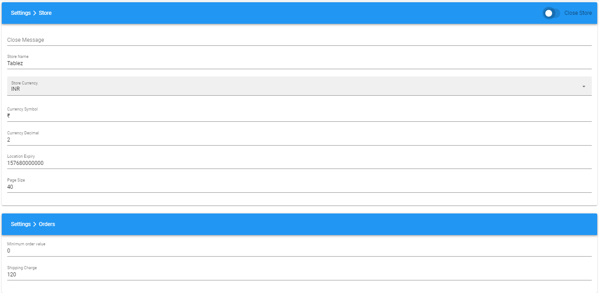
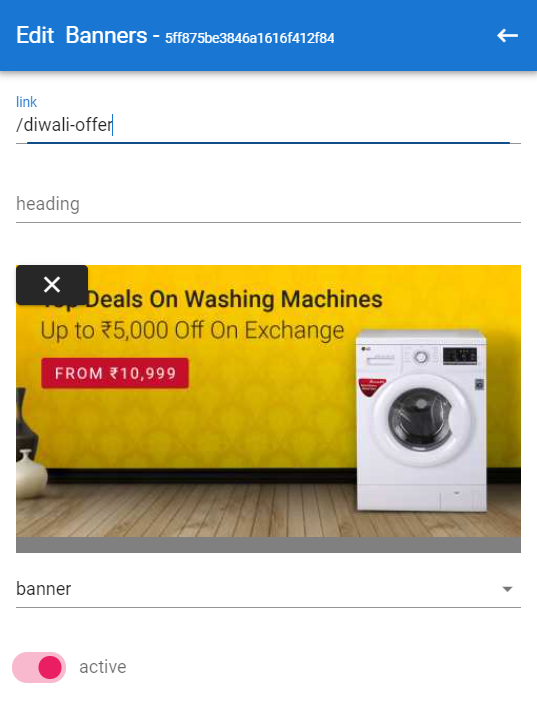
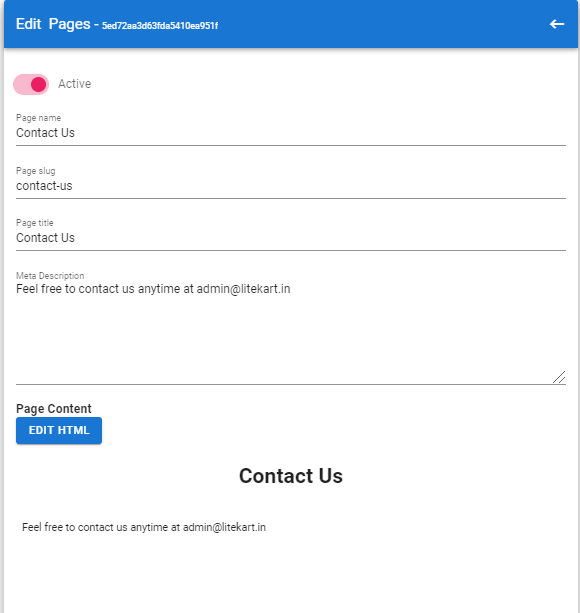
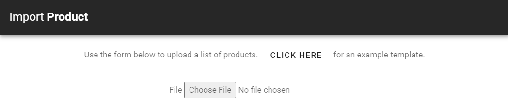
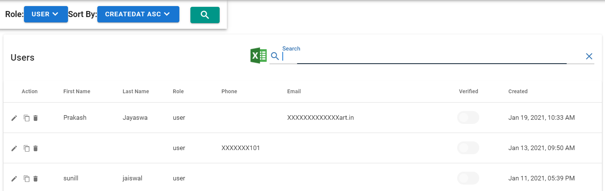
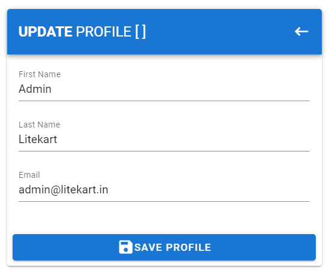

# Dashboard

The dashboard of our multi-vendor contains

- Customers count
- Products count
- Categories count
- Orders count
- Payments count
- Pending orders list

# Catalog

The catalog is combined of product, category, product attribute, coupon and manufacturer modules. With the help of these modules, you will be able to manage your product catalog effortlessly. All the functionalities you need is there.

## Products page

This is the products page of our Javascript e-commerce store. Here we get

- List of all products
- Export all products in csv file
- Filter Products: based on `Price (Price Slider), Brand, Features (Color, Type, Fit, Fabric, Neck)`
- Sort: Based on Price and Name
- Delete product button
- Refresh products button
- Add new product button
- Product Edit Page link

### Product Edit

This page allows to edit complete details of the product, this has four phases -

- Edit product details
- Edit features
- Edit images
- Edit Variants/Options

## Categories page

This is the category page of our Javascript e-commerce store. Here we get

- Create new category
- Export all categories in csv file
- Categories are presented in Parent-Child manner in store for better organisation of products.
- Store's navigation bar at top contains all the category arranged in parent-child fashion.
- This view provides facility to add both parent and child categories, re-arrange category association according to their requirement.

## Reviews page

This is the review page of product our Javascript e-commerce store. Here we get

- List of all reviews
- Export all reviews in csv file

## Options page

This is the options page of our Javascript e-commerce store. Here we get

- List of all option
- Create new option
- Edit existing option
- Export all options in csv file

## Features page

This is the feature page of our Javascript e-commerce store. Here we get

- List of all features
- Create new feature
- Edit existing feature
- Export all features in csv file

## Brands page

This is the brand page of our Javascript e-commerce store. Here we get

- List of all brands
- Create new brand
- Edit existing brand
- Export all categories in csv file
- filter brands
- delete brands

## Coupons page

This is the coupon page of our Javascript e-commerce store. Here we get

- List of all coupon
- Create new coupon
- Edit existing coupon
- Export all coupons in csv file

## Sizes page

This is the coupon page of our Javascript e-commerce store. Here we get

- List of all coupon
- Create new coupon
- Edit existing coupon
- Export all coupons in csv file

## Colors page

This is the coupon page of our Javascript e-commerce store. Here we get

- List of all coupon
- Create new coupon
- Edit existing coupon
- Export all coupons in csv file

## Units page

This is the coupon page of our Javascript e-commerce store. Here we get

- List of all coupon
- Create new coupon
- Edit existing coupon
- Export all coupons in csv file

# Transactions

The transaction is combined of orders, payments and cart modules. With the help of these modules, you will be able to manage your product transactions effortlessly. All the functionalities you need is there.

## Orders page

This is the order page of our Javascript e-commerce store. Here we get

- List of all order
- Create new order
- Edit existing order status
- Export all orders in csv file

## Payments page

This is the payment page of our Javascript e-commerce store. Here we get

- List of all payment
- Export all payments in csv file

## Abandoned Cart

This Admin Panel is featured with a cart facility which is easy to use and fast.

- List of all carts
- Export all carts in csv file
- Add new cart

# Email Templates

## Order Created

## Order Updated

# Settings

The settings provide modules for setup of the store, you will be able to manage your store setting effortlessly.

## Storefront

This is the storefront page of settings, which allows to edit attributes like.

- Store Name
- Currency
- Location
- Shipping charge

## Banners

This is the banner page of settings of our Javascript e-commerce store. Here we get

- List of all Banners
- Export all reviews in csv file
- Edit banner

## Images

This is the images page of settings of our Javascript e-commerce store. Here we get

- Add images/logo for the setting related
- Add images through graph image

## SMS/Email

This is the sms/email page of settings of our Javascript e-commerce store. Here we get

- Enable and disable sms and email
- Edit sms details
- Edit email details

## Payment method

This is the payment method page of settings of our Javascript e-commerce store. Here we get

- List of all payment method
- Export all payment method in csv file
- Edit payment method

## Pages

This page is responsible for settings of our Javascript e-commerce store pages. Here we get

- List of all pages
- Export all pages setting in csv file
- Edit pages setting

## Deals

This is the deal page of settings of our Javascript e-commerce store. Here we get

- List of all deals
- Create new deal
- Edit deal

# Monitoring

Monitoring List the product which don't have these functionalities. Admin can go the edit product page from here -

- No stock
- No image
- Invalid price
- No image
- No description

# Import/Export

This page is responsible for import/eport of our Javascript e-commerce store. Here we get

## Import

Import product allows to import products from csv file.

## Export

Export product allows to download the data in csv file. This provide these exports

- Export product with filter
- Export category
- Export brand
- Export feature
- Export size
- Export users

# Users

This is the Users page of our Javascript e-commerce store. Here we get

- List all users
- Export users
- Edit user details
- delete user
- Filter users list
- Sort by
- Add new user

# Address

This is the Address page of our Javascript e-commerce store. Here we get

- List all address
- Export address
- Edit address
- delete address
- Add new address

# Profile

This is the profile page of our Javascript e-commerce store. Here admin can edit profile.

# Login / Signup

Features like Signup / SignIn / Change Password / Logout is integrated into this application already with high level of security,
so that you no longer need to be worry about implementing all those features into the application

A user need <b>not</b> have to navigate to a separate page to login or signup. It comes as a popup which is a huge ui improvement.
This login popup has a advantage of poping out for any route when a guest user tries to access a restricted page Both the
login and signup page has the option for connect using facebook, twitter, google as well
