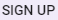
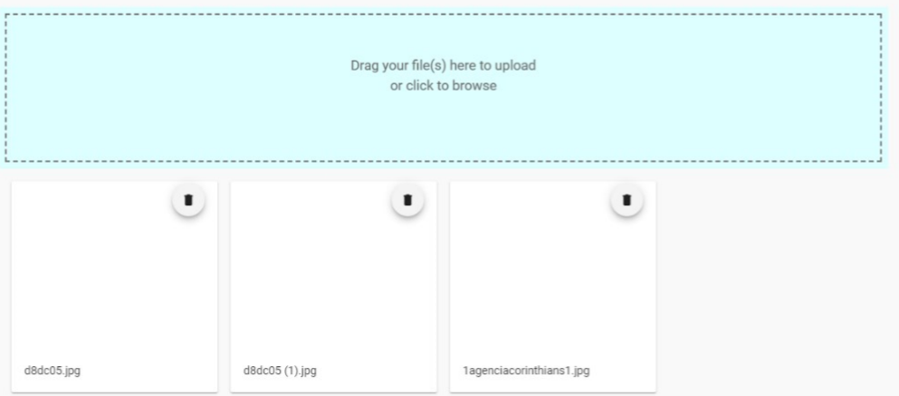
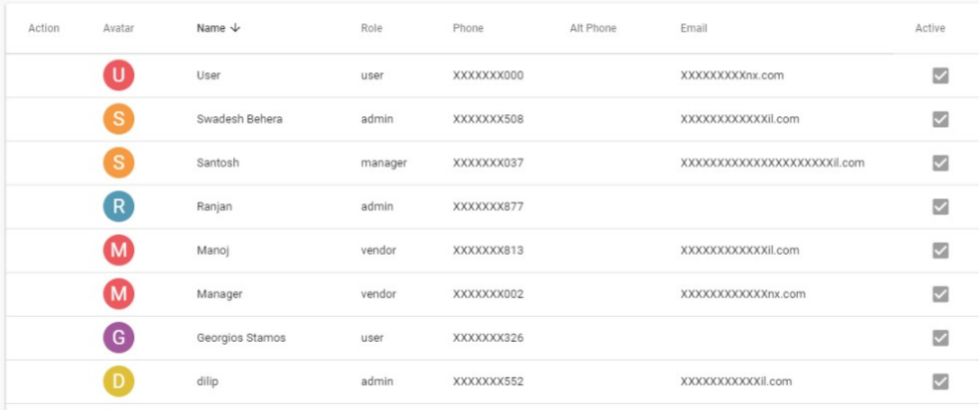
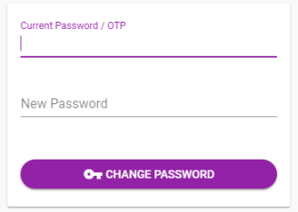
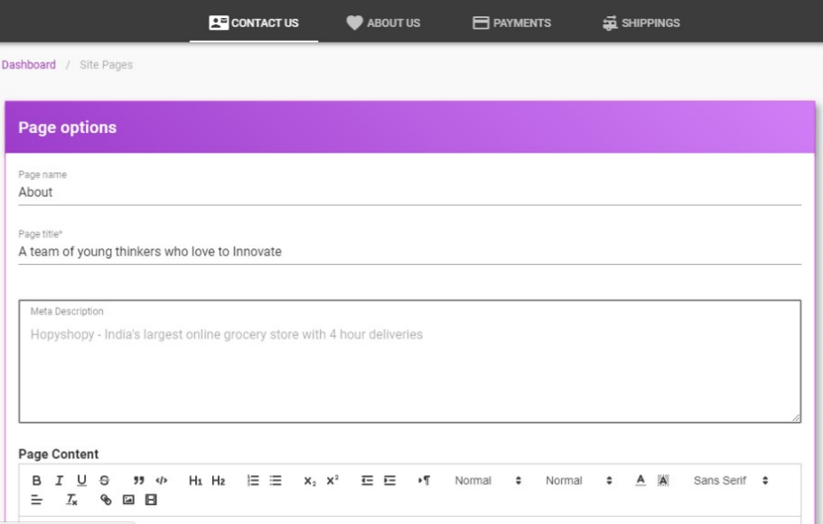

# Manual

## Description of Website

### Online Shopping:

Online shopping is a form of Electronic Commerce Which allows consumers to directly buy goods or services from a seller over the Internet using a Web browser.

### Homepage:

- It’s a starting page of a Website.
- In the starting of my website you will get a Sign in page where a customer can login & avail the benefits that we provide.

### Sign in:

It has two parts: -

- Email ID -> It is a unique ID.

- Password -> Password is a security code that a customer set for his privacy.

After filling all details, we have a sign in button which will check the user is valid or not, if it is valid then it will open my account or if it detects that the ID & password is invalid then the user has to input the details carefully.

### Forgot Password: -

If a customer forgot his/her password then he/she has to click on the forgot password then there he/she need to answer some security question. Then he/she given at the time of opening account.

### Sign up: -

If a user is not register to website then he/she can create a new account using sign up.

### Login with Facebook: -

If a user wants to open account he/she can directly connect with Facebook. So the account will be open using Facebook details.

 

After successfully login then the Menu page will be listed in the left corner of the page & the 1st option that will be opened is Dashboard.

In the Dashboard there are different option that we can see such like: -

- Total customer

- Order Total

- Reviews

- Total products.

### Pending Orders: -

In pending orders we can see the status of the order place by the cus-tomer & we can get details about it.

### Reviews: -

Review is the nothing but a comment box in which customers give their re-views about the product that they have ordered & used. In this the customer gives some ratings to the product in a form of stars that has different meaning.

• In right corner of the page have subscribe link. One can follow or subscribe the web-site.

### Products: -

Different variety of products can be seen & we can see the details of prod-ucts.A product can be a service or an item.

• Every product is made at a cost & each is sold at a price.

• It has a barcode. Bar code is a square or rectangular image consist of a series of parallel blacklines & white spaces of varying widths that can be read by a scanner. Barcodes are applied to products as a means of quick identifica-tion.

### Manage order: -

In the manage order the customer can manage his/her order that can help them to edit or it give them access to cancel and update it.

When we will open the manage order page then we see an Order ID that gives an identifi-cation for a particular product that we are purchased and it show the detail about the order.

In the manage order we see the order that are pending, shipped, cancelled and the order that are delivered. This are some of the features that the manage order gives.

Here a customer support option is provided by us that a customer can never face any prob-lem regarding the order.

### Manage Review: -

In the review section the customer can review or can say any experience about the product that they have purchased in the past.

In the review section, one customer can view and take some suggestion and take some knowledge regarding about the order that they are going to be purchased by the customer.

Review section is having rating in the form of giving stars to the products. The star shows different meaning like-

- 1 Star-Poor

- 2 Star-Average

- 3 Star-Good

- 4 Star-Very Good

- 5 Star-Excellent

A user can anytime give any comment to the product and he can edit and delete it too.

### Media library: -

In the library section we can see a drag and drop option were a customer can browse a pic we want to drag and upload the image of a product.

We can see the product that we are inserted before sometime and delete it too so we can remove the product that we have uploaded.

Media library allows a customer to sell his or her own items that he/she want to sell.

### Brand: -

In the brand section there are the bands of the different product that are available in the store can be seen.

The list has 4 rows that contains option like Action, name, image and active this are the rows header that shows the details about the brand.

1. In the action row we can edit, delete and copy the details about the brand can be easily done.
2. In the name row we can find the different name of the product brand that the mer-chant sells.
3. In the image row we can find the image or logo of the brand that are known by the symbols of the unique logo.
4. In the active section we can see the brand that are recently availing some discounts and other offers.
   And at the last we have an add symbol at the bottom of the page so that one can add some other brand that are not listed in the list.

### Categories: -

In the category section we have a list of different category that are available in the site, here we have two categories that we can see is the men and the women section.

Category provide us a way to filter the order by selecting category so the item related to the category can only be seen and other product are not visible there.

This is an important and essential feature which provide a relief to the customer to select and shop according to their requirement.

We can easily edit and delete or reset the category section so we don’t have to panic about it.

### Features: -

In the feature section it comes after one applies the category to the product so the feature option provides more description to choose the product by their look and style.

In the feature section we have 5 row that are action, key, value, category and active by see-ing all this out by choosing the different option one can find a best product that he wants to buy.

The work of the action and category row we already know and the key and row describe the color and type of the product it is.

### Coupons: -

In the coupon section the coupons that are available and active so a user can get benefits in the price section and or in the other department.

We can get different discounts offers and many other like movies and in the food section also.

We can see that if we open the page then we see the action the code, amount and mini-mum cart value and the information about the code that is valid during the time period.

Coupons are the best way to attract the customer and start exploring and attracting the customer.

### Shipping: -

Shipping information is to get details about the courier through the different courier that are giving their services to the customer.

It gives full details about the product that is going to be delivered and through which cou-rier the seller is sending the product to the customer.

It gives the details about the cost and the expected date of delivering the product to the customer can be easily known form here.

### Payment: -

Payment section shows the payment details about the order we have placed recently through the account.

It gives us the information that will need in the future as well as in the present to receive the order successfully.

In the payment method we can see the total cost and the extra charge that is going to be deduct or through which method we are paying the order.

As we can see that here we have an order that is having an order date and the amount that he is going to pay through the method of COD.

We can choose different other paying option like credit card, debit card, online banking or through the UPI.

### User: -

In the user section we can see the list of different user that are using and are the part of this shopping site.

Here in this page we can see the list has different details that showing us about the particu-lar user that are joined and are working with us.

Through this we can easily contact them by the phone number and other details like their mail id and the designation that they are bearing here.

We can see photo of every user that is active and are performing any role in the website.

### Profile: -

In the profile section we can edit the profile of our individual and update the de-tails that we have given before.
This is very much important so that every small change can be regularly updated so that we cannot face any problem in opening the account.

Through this we can update the details like ph. no, address and other important data that we need to regular update so that it will help to make an account very strong and active.

### Change Password: -

In the change password section if we want to change the password we can easily change by two simple step.

In this we have n 1st step that is current password were we have to enter the old password that we are using for login in otherwise we have another option of OTP through this we can get an OTP in the registered mob no and then we proceed to the next step.

In the next step we have to enter the new password that we will use to login the account in future.

After filling all the details just, we have to click on the change password button.

### Setting: -

In the setting section we have 4 tab ->

- Shop Setting

- Login Service

- SMS & Email

- Payments

• Shop Setting: -

In the Shop setting we can edit or insert the name title & other de-tails.

• Login: -

In the login service we can login from different social website.

• SMS & Email: -

In the SMS enable option when we enable the messaging facility which allow the admin to send a message regarding the offers & other subscription details.

• Payment: -

In the payment section the admin chooses the way through which can choose the medium to pay.

 

### Site Pages: -

In the site page, admin can create new contents, like

• Contact us

• About us

• Payment

• Shipping

 

### Banner: -

In the Banner page different tabs are there, like

- Slider: - This section controls the main page slider.

- Promotions: - 2nd section at homepage. These are promotional banners for the homepage.

- Deal of the day: - 3rd section at homepage. Page which shows active deals.

